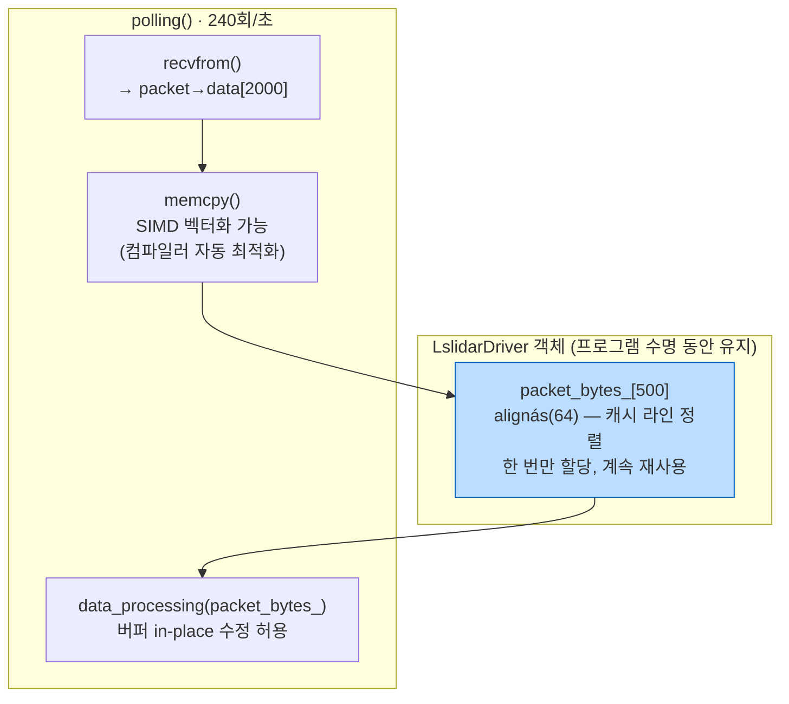
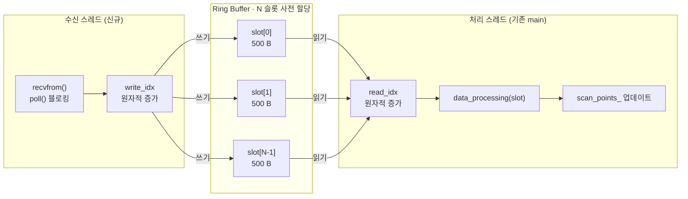
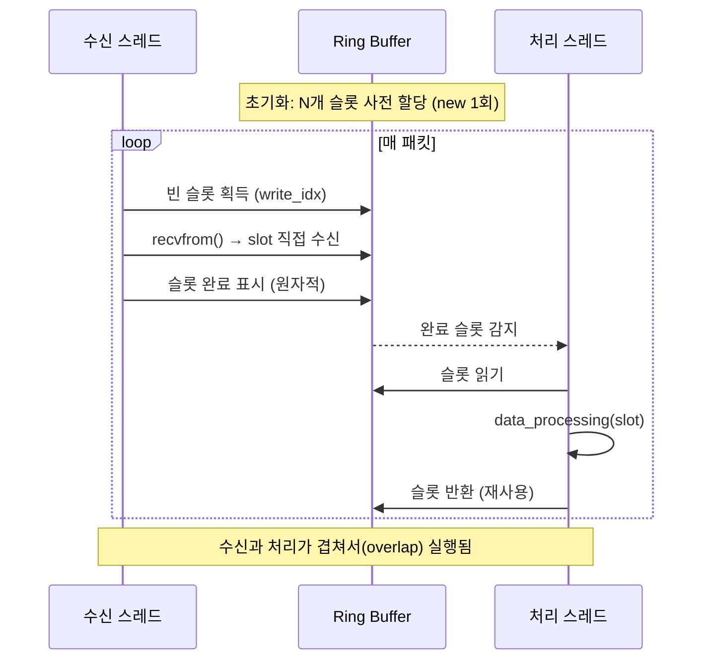
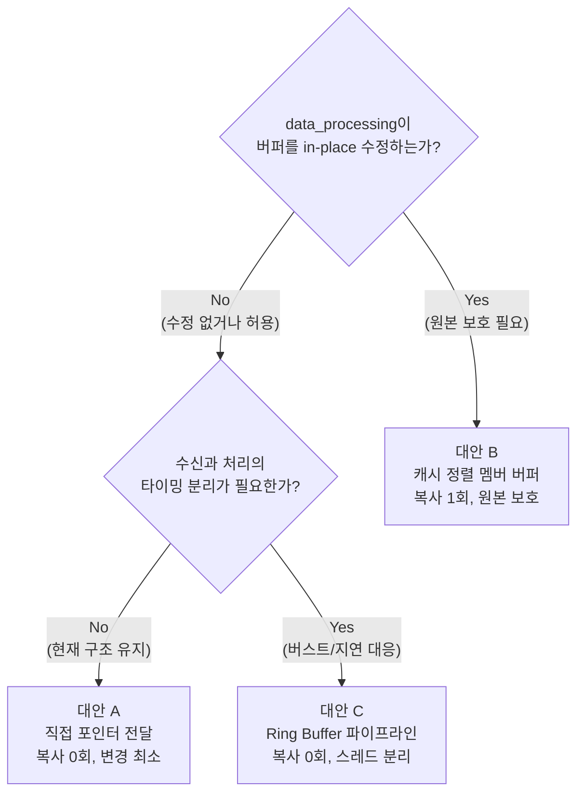

# 이슈1 추가 설계 대안: 패킷 버퍼 메모리 할당 및 복사 문제

## 이슈1 재요약

`polling()` 은 초당 240회 호출되며, 매 호출마다:

1. `new unsigned char[500]` — heap 동적 할당
2. `packet->data[i]` → `packet_bytes[i]` byte-by-byte 루프 복사
3. `delete packet_bytes` — 해제

이미 제안된 **대안 A (직접 포인터 전달)** 외에, 상황에 따라 유효한 두 가지 추가 설계 대안을 제시한다.

> **참고:** `data_processing()` 내부에서 버퍼를 직접 수정하는 코드가 존재한다.
> ```cpp
> // lslidar_driver.cc — data_processing()
> packet_bytes[86] = 0xFF;   // 수신 데이터를 제자리(in-place) 수정
> packet_bytes[87] = 0xFF;
> ```
> 이 수정이 필요한 경우 단순 포인터 전달은 원본 메시지를 오염시킬 수 있으므로,
> 복사본이 필요한 상황도 존재한다. 아래 두 대안은 이 점을 고려한다.

---

## 대안 B: 캐시 정렬 멤버 버퍼 (Cache-Aligned Member Buffer)

### 설계 개념

`packet_bytes` 를 매 호출마다 heap에서 할당/해제하는 대신,
`LslidarDriver` **클래스 멤버 변수**로 사전 할당한다.
`polling()` 은 단일 스레드에서 호출되므로 경쟁 조건(race condition) 없이 안전하게 재사용할 수 있다.

### 데이터 흐름



### 특징

| 항목 | 현재 | 대안 B |
|---|---|---|
| 버퍼 할당 위치 | heap (매 호출) | 클래스 멤버 (1회) |
| heap alloc 횟수 | 240회/초 | 0회 |
| 복사 방식 | byte-by-byte 루프 | `memcpy` (SIMD 최적화) |
| in-place 수정 | 허용 | 허용 (원본 packet 보호됨) |
| 직렬/네트워크 인터페이스 | 각각 다른 경로 | 동일 버퍼로 통일 가능 |

### 설계 포인트

- **`alignas(64)`** — 캐시 라인(64B) 경계에 정렬하여 false sharing 및 캐시 미스 최소화
- **직렬 인터페이스 통일** — 시리얼 경로(`receive_data()`)도 동일 멤버 버퍼를 채우게 하여 코드 경로를 단일화
- **코드 변경 최소** — 함수 시그니처 변경 없이 `polling()` 내 `new/delete` 만 제거

### 대안 A와의 차이

| | 대안 A (직접 포인터 전달) | 대안 B (멤버 버퍼) |
|---|---|---|
| 복사 횟수 | 0회 | 1회 (memcpy) |
| in-place 수정 안전성 | 원본 packet 수정됨 | 복사본 수정, 원본 보호 |
| 시리얼 인터페이스 적용 | 별도 처리 필요 | 동일 버퍼로 통일 |
| 구조 변경 규모 | 최소 | 최소 |

> `data_processing()` 의 in-place 수정이 반드시 격리되어야 한다면 대안 B가 적합하다.

---

## 대안 C: 수신-처리 파이프라인 분리 (Producer-Consumer Ring Buffer)

### 설계 개념

현재 `polling()` 은 **수신**과 **처리**를 하나의 함수에서 순차적으로 수행한다.
수신(I/O 블로킹) 과 처리(CPU 연산) 를 분리하고, 사전 할당된 **링 버퍼 슬롯**을 통해 연결한다.

```
현재:  [수신(블로킹)] → [처리] → [수신(블로킹)] → [처리] ...  (직렬)

대안:  수신 스레드  → [링 버퍼] → 처리 스레드  (병렬 파이프라인)
```

### 데이터 흐름



### 슬롯 수명 주기



### 특징

| 항목 | 현재 | 대안 C |
|---|---|---|
| 수신/처리 관계 | 직렬 (순차) | 병렬 파이프라인 |
| heap alloc 횟수 | 240회/초 | 1회 (초기화 시) |
| 버스트 대응 | 수신 중 처리 블로킹 | 링 버퍼가 버퍼링 |
| I/O 블로킹 영향 | 처리 전체를 지연 | 처리 스레드 독립 |
| 구조 변경 규모 | — | 중간 (스레드 추가) |

### 적용 조건

- LiDAR 회전 속도가 높거나 패킷 처리 시간이 수신 간격보다 길어질 때 효과적
- N = 링 버퍼 슬롯 수는 `최대 처리 지연 / 패킷 수신 주기` 를 기준으로 결정
  (예: 처리 최악 10ms, 패킷 주기 4ms → N ≥ 3 이면 버퍼 오버플로 없음)
- 슬롯 수를 늘려도 메모리는 `N × 500 B` 에 불과

---

## 세 가지 대안 종합 비교



| 항목 | 대안 A (직접 포인터) | 대안 B (멤버 버퍼) | 대안 C (Ring Buffer) |
|---|---|---|---|
| heap alloc 횟수 | 0회 | 0회 | 1회 (초기화) |
| 복사 횟수 | 0회 | 1회 (memcpy) | 0회 |
| 원본 packet 보호 | X | O | O |
| 버스트 흡수 | X | X | O |
| 코드 변경 규모 | 최소 | 최소 | 중간 |
| 적합한 상황 | in-place 수정 없을 때 | in-place 수정 있을 때 | 고속 회전 / 처리 지연 |
