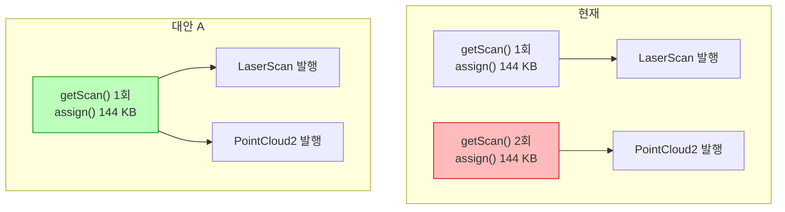
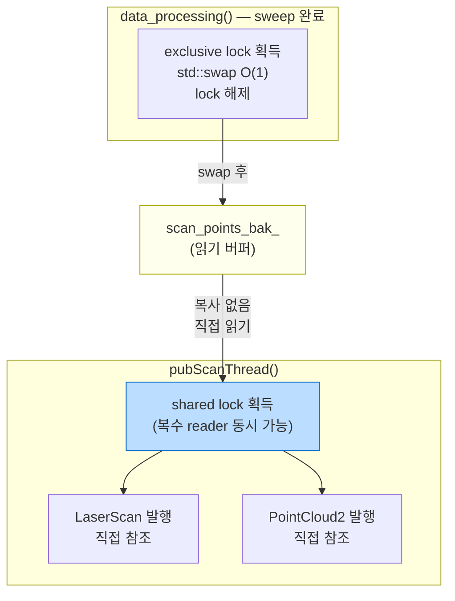
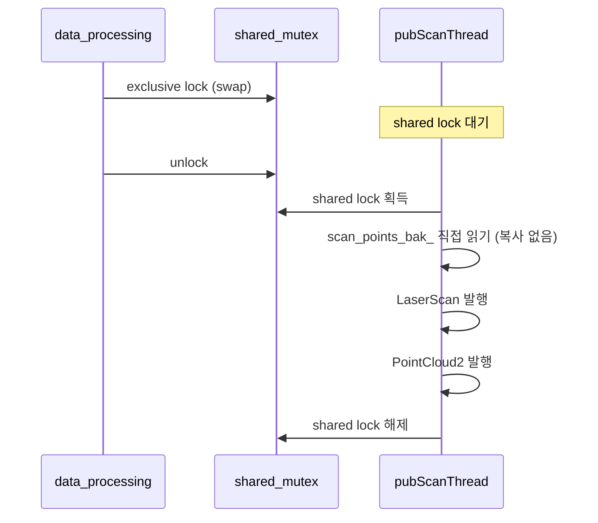
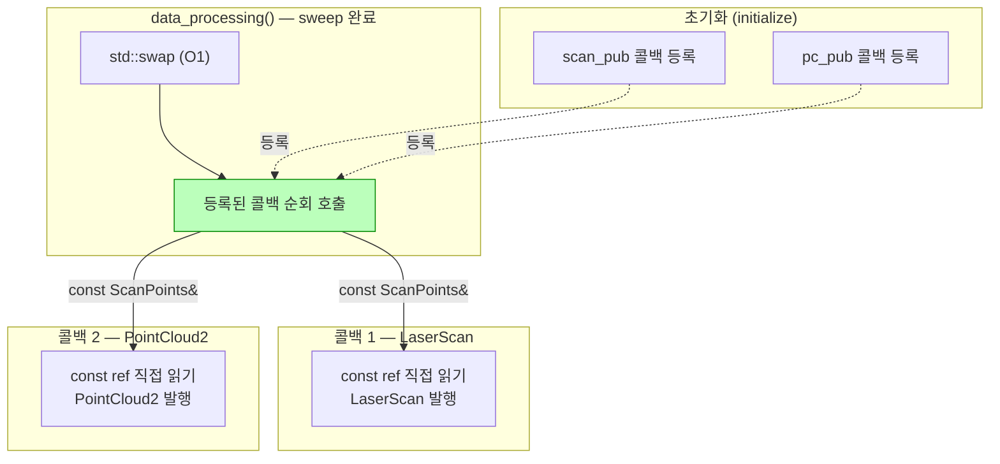
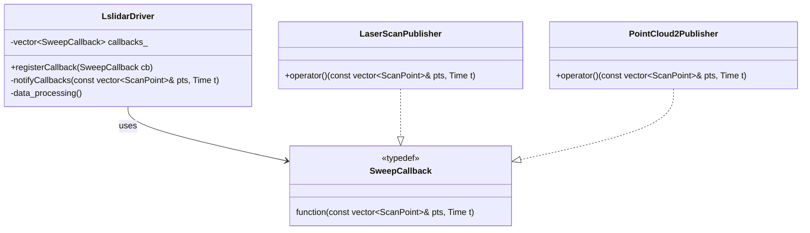
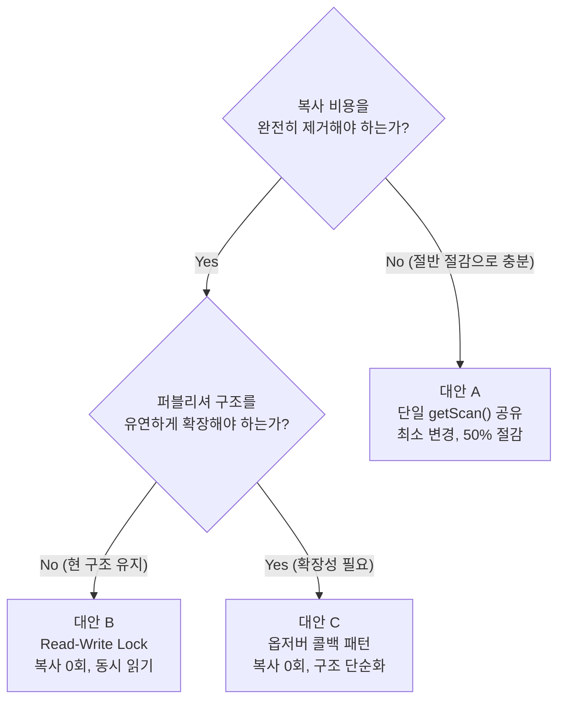

# 이슈3 설계 대안: pubScanThread() getScan() 중복 호출

## 이슈3 재요약

`pubScanThread()` 에서 `pubScan` 과 `pubPointCloud2` 가 동시에 활성화된 경우,
동일한 스윕 데이터에 대해 `getScan()` 이 **두 번 호출**된다.
`getScan()` 내부는 매 호출마다 `scan_points_bak_` 전체를 로컬 벡터로 **`assign()` 복사**한다.

```cpp
// lslidar_driver.cc — pubScanThread()
if (pubScan) {
    std::vector<ScanPoint> points;
    this->getScan(points, start_time, scan_time);  // ① 144 KB 복사
    // LaserScan 발행...
}
if (pubPointCloud2) {
    std::vector<ScanPoint> points;
    this->getScan(points, start_time, scan_time);  // ② 144 KB 복사 (동일 데이터)
    // PointCloud2 발행...
}
```

```cpp
// getScan() 내부
int LslidarDriver::getScan(...) {
    boost::unique_lock<boost::mutex> lock(mutex_);
    points.assign(scan_points_bak_.begin(), scan_points_bak_.end());  // O(n) 복사
    ...
}
```

**결과:** 동일 스윕을 매 사이클(10회/초)마다 288 KB 중복 복사.

---

## 대안 A: 단일 getScan() 호출 + 공유 (Single Call, Shared Result)

### 설계 개념

`pubScanThread()` 루프 진입 직후 `getScan()` 을 **한 번만** 호출하고,
반환된 `points`, `start_time`, `scan_time` 을 LaserScan 과 PointCloud2 퍼블리셔가 **공유**한다.

### 데이터 흐름



### 특징

| 항목 | 현재 | 대안 A |
|---|---|---|
| getScan() 호출 횟수 | 2회/sweep | 1회/sweep |
| 복사 횟수 | 288 KB/sweep | 144 KB/sweep |
| 코드 변경 규모 | — | 최소 (호출 위치 이동) |

- 구조 변경 없이 `getScan()` 호출 위치만 루프 상단으로 이동
- 가장 단순하고 즉각적인 개선
- `scan_time` 이 LaserScan 발행에도 사용되므로 공유에 문제 없음

---

## 대안 B: 읽기-쓰기 락 + 직접 참조 (Read-Write Lock / Zero-Copy View)

### 설계 개념

현재 `mutex_` 는 단순 `boost::mutex` (exclusive lock) 이다.
이를 **읽기-쓰기 락(`boost::shared_mutex`)** 으로 교체하면:

- `data_processing()` (쓰기) → **독점(exclusive) 락** 으로 swap 수행
- `pubScanThread` (읽기) → **공유(shared) 락** 으로 `scan_points_bak_` 를 **직접 참조**

`getScan()` 의 `assign()` 복사 자체를 제거하고,
퍼블리셔가 `scan_points_bak_` 를 복사 없이 직접 읽는다.

### 데이터 흐름



### 락 타임라인



### 특징

| 항목 | 현재 | 대안 B |
|---|---|---|
| getScan() 복사 | 144 KB × 2회 | **0 KB** (직접 참조) |
| 락 종류 | exclusive mutex | shared_mutex (read-write) |
| 동시 읽기 | 불가 | 가능 (복수 reader) |
| 코드 변경 규모 | — | 중간 (락 타입 변경 + getScan 제거) |

- `getScan()` 함수 자체를 제거하거나 shared lock 을 반환하는 형태로 변경
- LaserScan 과 PointCloud2 를 동일 shared lock 구간 내에서 순차 발행
- 미래에 publisher 가 추가되어도 복사 비용 증가 없음

---

## 대안 C: 옵저버 패턴 + 콜백 (Observer Pattern / Event-Driven)

### 설계 개념

현재 구조는 `pubScanThread` 가 `pubscan_cond_` 를 기다리며 **능동적으로 데이터를 가져오는(pull)** 방식이다.

이를 `data_processing()` 이 sweep 완료 시 등록된 콜백을 **능동적으로 호출하는(push)** 방식으로 전환한다.

- 각 퍼블리셔(LaserScan, PointCloud2)가 콜백으로 등록
- `data_processing()` 은 sweep 완료 시 모든 콜백에 `scan_points_bak_` 를 **const 참조로 전달**
- 별도의 `pubScanThread` 와 조건 변수 불필요 → 구조 단순화

### 아키텍처



### 콜백 등록 구조



### 특징

| 항목 | 현재 | 대안 C |
|---|---|---|
| getScan() 복사 | 144 KB × 2회 | **0 KB** (const 참조 전달) |
| pubScanThread | 필요 (조건 변수 대기) | **불필요** (콜백으로 대체) |
| 조건 변수 | 필요 | **불필요** |
| 퍼블리셔 추가 시 | pubScanThread 수정 | 콜백 등록만 추가 |
| 코드 변경 규모 | — | 중간~크게 (스레드 구조 변경) |

- `pubScanThread` 와 `pubscan_cond_` 제거로 동기화 복잡도 감소
- 퍼블리셔 추가/제거가 `registerCallback()` 호출 하나로 가능 → **개방-폐쇄 원칙(OCP)**
- 콜백은 `data_processing()` 스레드에서 실행되므로, 콜백 내 publish 는 가볍게 유지해야 함

---

## 세 가지 대안 종합 비교



| 항목 | 대안 A | 대안 B | 대안 C |
|---|---|---|---|
| 복사 절감 | 50% (144 KB) | 100% (0 KB) | 100% (0 KB) |
| 동시 읽기 | X | O | N/A (단일 스레드 콜백) |
| pubScanThread 필요 | O | O | **X (제거)** |
| 퍼블리셔 추가 용이성 | 낮음 | 낮음 | **높음** |
| 코드 변경 규모 | 최소 | 중간 | 중간~크게 |
| 적합한 상황 | 즉각 개선 | 고주파 데이터 | 확장/유지보수 중심 |
