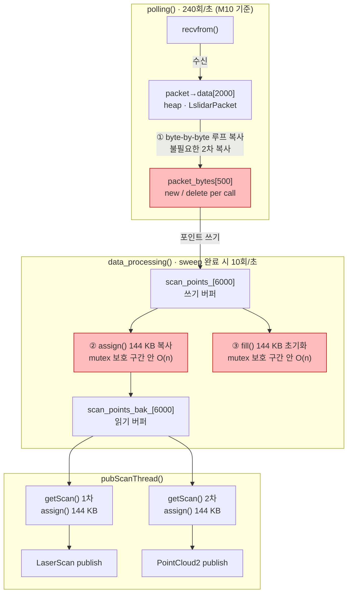
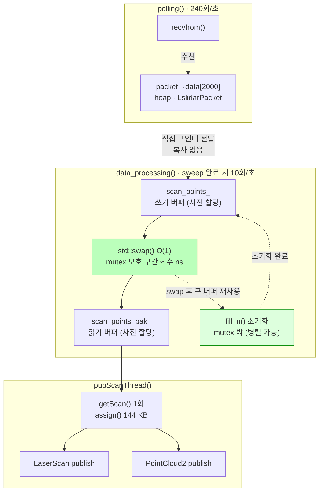
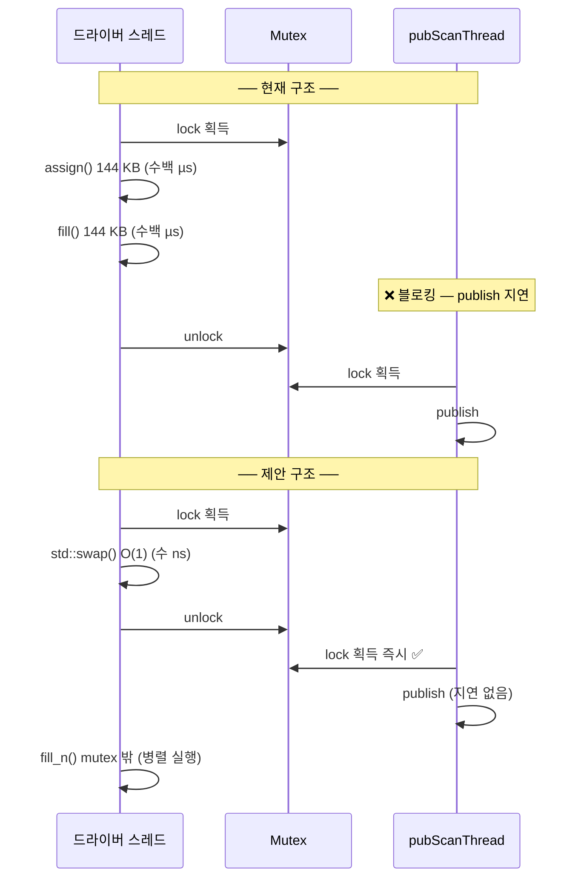

# 이슈1 + 이슈2 통합 수정 설계: Zero-Copy 패킷 처리 + 더블 버퍼 스캔 포인트

---

## 1. 문제 범위

이슈1(패킷 복사)과 이슈2(스캔 버퍼 복사)는 **동일한 데이터 파이프라인의 연속된 구간**에서 발생한다.
두 이슈를 함께 설계하지 않으면 중간 버퍼의 존재 이유가 모호해지므로, 하나의 설계 원칙으로 통합 해결한다.

---

## 2. 현재 구조 — 문제

### 2-1. 현재 데이터 흐름

### 2-2. 핵심 문제

| # | 위치 | 문제 | 부하 |
|---|---|---|---|
| ① | `polling()` | 패킷마다 heap `new/delete` + byte-by-byte 루프 복사 | 240회/초 힙 할당, 캐시 오염 |
| ② | `data_processing()` | mutex 내 `assign()` 144 KB 복사 | mutex 점유 O(n), publisher 블로킹 |
| ③ | `data_processing()` | mutex 내 `fill()` 144 KB 초기화 | mutex 점유 추가 O(n) |

`pubScanThread`는 ②③이 끝날 때까지 mutex를 얻지 못해 **LaserScan / PointCloud2 발행이 수백 µs 지연**된다.

---

## 3. 통합 설계 원칙

> **패킷 버퍼는 복사하지 않고 직접 전달한다.**
>
> **스캔 버퍼는 두 개를 사전 할당하고, mutex 구간에서는 포인터 교환(swap)만 수행한다.**

---

## 4. 수정 설계 — 제안

### 4-1. 제안 데이터 흐름

### 4-2. 구간별 변경 설계

#### ● 패킷 경로 (이슈1 해결)

| 항목 | 현재 | 제안 |
|---|---|---|
| 버퍼 할당 | `new unsigned char[500]` per call | `packet->data.data()` 직접 참조 — 할당 없음 |
| 복사 방식 | byte-by-byte 루프 | 복사 없음 (직접 전달) |
| 해제 | `delete` per call | 없음 |
| double free 위험 | 있음 (이슈5) | 제거됨 |

`polling()` 이 `data_processing()` 을 호출할 때 `packet->data.data()` 를 직접 전달한다.
`packet` 객체는 `polling()` 스코프 내에서 유효하므로 dangling pointer 위험 없다.

---

#### ● 스캔 버퍼 경로 (이슈2 해결)

| 항목 | 현재 | 제안 |
|---|---|---|
| `scan_points_bak_` 초기화 | sweep마다 런타임 `resize()` | `loadParameters()` 에서 동일 크기로 사전 할당 |
| sweep 완료 시 mutex 내 작업 | `assign()` 144 KB + `fill()` 144 KB | `std::swap()` O(1) 포인터 교환만 |
| 버퍼 초기화 위치 | mutex 내부 | mutex 해제 후 (`fill_n`), publisher와 병렬 실행 가능 |

### 4-3. mutex 점유 시간 비교

---

## 5. 전제 조건

- `scan_points_bak_` 는 `loadParameters()` 에서 `scan_points_` 와 **동일한 크기로 사전 할당 및 0-초기화** 한다.  
  (M10_DOUBLE 모델은 `idx + 3000` 까지 접근하므로 크기는 `points_size_ + 3000` 이상)
- `data_processing()` 함수 시그니처 `unsigned char *` 는 유지하고, 호출부에서 `packet->data.data()` 를 전달한다.
- 시리얼 경로(`interface_selection == "serial"`) 에서는 `receive_data()` 가 채우는 스택 버퍼를 동일하게 직접 전달한다.

---

## 6. 기대 효과

| 지표 | 현재 | 제안 |
|---|---|---|
| 패킷당 heap 할당 | 240회/초 | **0회** |
| 패킷당 복사 횟수 | 2회 | **0회** |
| mutex 점유 시간 | O(n) · ~수백 µs | **O(1) · ~수 ns** |
| pubScanThread 블로킹 | 있음 | **없음** |
| double free 버그 (이슈5) | 존재 | **자동 제거** |
